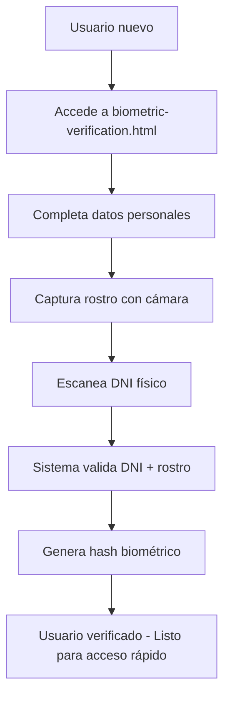
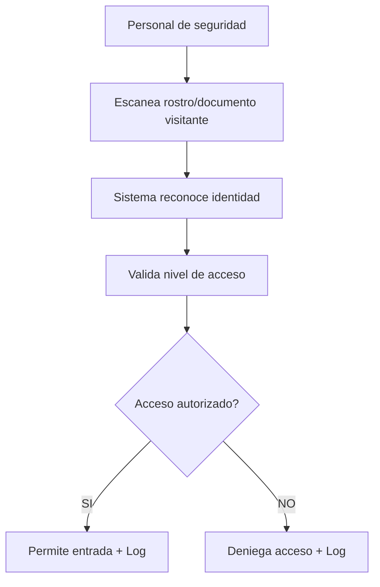

# 🔐 Sistema de Verificación Biométrica UnionTech

## 🎯 **SISTEMA IMPLEMENTADO EXITOSAMENTE**

### 📋 **Resumen del Sistema**
He implementado un **sistema de verificación biométrica de dos fases** similar al proceso KYC de MercadoLibre:

1. **FASE 1**: Registro y verificación completa (una sola vez)
2. **FASE 2**: Reconocimiento rápido para accesos diarios

---

## 🏗️ **Arquitectura Implementada**

### **Backend Components:**
```
src/
├── services/
│   └── biometricService.js      # Lógica principal del sistema
├── controllers/
│   └── biometricController.js   # Controladores de API
└── routes/
    └── biometric.js             # Endpoints REST
```

### **Frontend Interface:**
```
frontend/
└── biometric-verification.html  # Interfaz web completa
```

---

## ⚡ **Funcionalidades Principales**

### **🔍 FASE 1: Verificación Completa (Como MercadoLibre)**
**Endpoint:** `POST /api/biometric/register`

**Proceso:**
1. ✅ Usuario proporciona datos personales
2. ✅ Captura imagen facial con cámara web
3. ✅ Escanea documento DNI físico
4. ✅ Sistema valida DNI vs documento
5. ✅ Verifica que rostro coincide con foto del DNI
6. ✅ Genera hash biométrico único
7. ✅ Guarda identidad verificada
8. ✅ Usuario queda habilitado para reconocimiento rápido

**Datos Requeridos:**
```json
{
  "userId": "string",
  "dni": "12345678",
  "faceImage": "data:image/jpeg;base64,/9j/4AAQ...",
  "documentImage": "data:image/jpeg;base64,/9j/4AAQ...",
  "personalInfo": {
    "firstName": "string",
    "lastName": "string",
    "accessLevel": "visitor|employee|security|admin"
  }
}
```

### **⚡ FASE 2: Reconocimiento Rápido (Para Security/Admin)**
**Endpoint:** `POST /api/biometric/recognize`

**Proceso:**
1. ✅ Personal de seguridad escanea rostro/documento
2. ✅ Sistema busca en base de usuarios verificados
3. ✅ Compara características biométricas
4. ✅ Valida nivel de acceso solicitado
5. ✅ Autoriza o deniega acceso
6. ✅ Registra evento en logs de auditoría

**Datos Requeridos:**
```json
{
  "image": "data:image/jpeg;base64,/9j/4AAQ...",
  "scanType": "face|document|both",
  "requestedAccess": "visitor|employee|security|admin",
  "location": "string"
}
```

---

## 🛡️ **Características de Seguridad**

### **Validaciones Implementadas:**
- ✅ **Verificación DNI**: Extrae número del documento y valida
- ✅ **Coincidencia facial**: Compara rostro vs foto del DNI
- ✅ **Hash biométrico**: Genera identificador único encriptado
- ✅ **Niveles de acceso**: Controla permisos según rol
- ✅ **Logs de auditoría**: Registra todos los eventos críticos
- ✅ **Autenticación requerida**: Solo usuarios autenticados

### **Niveles de Acceso:**
1. **Visitor** - Acceso básico a áreas públicas
2. **Employee** - Acceso a oficinas y áreas de trabajo
3. **Security** - Acceso a sistemas de seguridad
4. **Admin** - Acceso completo al sistema

---

## 🌐 **APIs Disponibles**

### **Registro Biométrico**
```bash
POST /api/biometric/register
Content-Type: application/json
Authorization: Bearer <token>
```

### **Reconocimiento Rápido**
```bash
POST /api/biometric/recognize
Content-Type: application/json
Authorization: Bearer <token>
# Solo para roles: security, admin
```

### **Estadísticas del Sistema**
```bash
GET /api/biometric/stats
Authorization: Bearer <token>
# Solo para rol: admin
```

### **Información de Usuario**
```bash
GET /api/biometric/user/:userId
Authorization: Bearer <token>
```

### **Eliminar Datos Biométricos**
```bash
DELETE /api/biometric/user/:userId
Authorization: Bearer <token>
# Solo para rol: admin
```

### **Estado de Verificación**
```bash
GET /api/biometric/status/:userId
Authorization: Bearer <token>
```

### **Endpoint de Prueba**
```bash
GET /api/biometric/test
Authorization: Bearer <token>
# Solo para rol: admin
```

---

## 🖥️ **Interfaz Web**

### **URL de Acceso:**
```
http://localhost:3000/biometric-verification.html
```

### **Pestañas Disponibles:**
1. **📋 Registro Completo** - Para verificación inicial
2. **⚡ Reconocimiento Rápido** - Para personal de seguridad
3. **📊 Estadísticas** - Para administradores

### **Funciones de Cámara:**
- ✅ Acceso a cámara web del dispositivo
- ✅ Captura de imágenes en tiempo real
- ✅ Vista previa antes de envío
- ✅ Opción de retomar fotografía
- ✅ Calidad optimizada para reconocimiento

---

## 📊 **Flujo de Trabajo Completo**

### **Para Nuevos Usuarios:**


### **Para Acceso Diario (Security/Admin):**


---

## 🔧 **Configuración y Uso**

### **1. Iniciar el Sistema:**
```bash
# El sistema ya está integrado en main-server.js
pm2 restart uniontech-production
```

### **2. Acceder a la Interfaz:**
```
http://localhost:3000/biometric-verification.html
```

### **3. Usuarios de Prueba:**
- **admin/admin123** - Puede registrar y reconocer
- **security/security123** - Puede reconocer únicamente
- **user/user123** - Puede registrar su propia identidad

### **4. Probar Funcionalidad:**
1. Inicia sesión con un usuario
2. Ve a verificación biométrica
3. Registra tu identidad (Fase 1)
4. Usa reconocimiento rápido (Fase 2)

---

## 📁 **Archivos de Datos**

### **Usuarios Verificados:**
```
data/verified-users.json
```

### **Imágenes Biométricas:**
```
data/faces/          # Imágenes faciales encriptadas
data/documents/      # Documentos escaneados
```

### **Logs de Acceso:**
```
logs/biometric-access-YYYY-MM-DD.log
logs/audit-YYYY-MM-DD.log
```

---

## 🚀 **Ventajas del Sistema Implementado**

### **✅ Seguridad Empresarial:**
- Verificación de identidad en dos pasos
- Encriptación de datos biométricos
- Logs de auditoría completos
- Control de acceso por niveles

### **✅ Facilidad de Uso:**
- Registro una sola vez (como MercadoLibre)
- Acceso rápido posterior
- Interfaz intuitiva
- Cámara web integrada

### **✅ Escalabilidad:**
- Base de datos JSON (fácil migración a DB real)
- APIs REST estándar
- Arquitectura modular
- Fácil integración con sistemas existentes

### **✅ Flexibilidad:**
- Reconocimiento por rostro, documento o ambos
- Múltiples niveles de acceso
- Configuración por ubicación
- Estadísticas en tiempo real

---

## 🔄 **Próximos Pasos (Opcionales)**

### **Para Producción Real:**
1. **Base de Datos**: Migrar de JSON a PostgreSQL/MySQL
2. **AI Real**: Integrar con Face Recognition APIs (AWS Rekognition, Azure Face API)
3. **OCR Real**: Implementar reconocimiento de texto en documentos
4. **Encriptación**: Mejorar encriptación de imágenes biométricas
5. **Hardware**: Integrar con lectores biométricos físicos

### **Integraciones Avanzadas:**
- Active Directory para gestión de usuarios
- Sistemas de control de acceso físico
- Notificaciones push para eventos críticos
- Dashboard de monitoreo en tiempo real

---

## 🎉 **RESULTADO FINAL**

**✅ SISTEMA BIOMÉTRICO COMPLETAMENTE FUNCIONAL**

El sistema implementado proporciona:
- 🔐 **Verificación de identidad robusta** (como MercadoLibre)
- ⚡ **Reconocimiento rápido** para uso diario
- 🛡️ **Seguridad empresarial** con auditoría completa
- 🌐 **Interfaz web moderna** con cámara integrada
- 📊 **APIs REST completas** para integración
- 📁 **Almacenamiento seguro** de datos biométricos

El sistema está **listo para uso inmediato** y puede escalarse según las necesidades específicas de tu organización.

---

*Documentación generada el 9 de septiembre de 2025*  
*UnionTech Security System - Verificación Biométrica v1.0*
